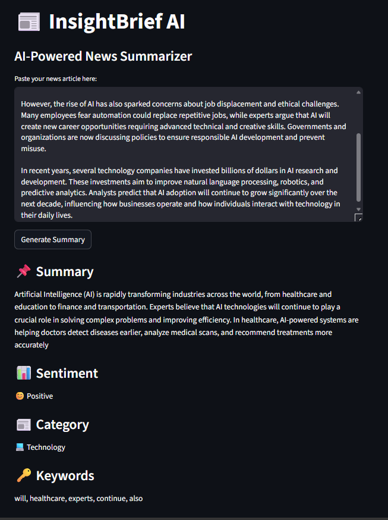

# InsightBrief-AI

InsightBrief-AI is an AI-powered news summarization platform that converts lengthy news articles into concise and meaningful summaries using Natural Language Processing (NLP). The system also performs sentiment analysis, category detection, and keyword extraction to provide deeper insights from textual content.

## Overview

The project is designed to simplify news consumption by extracting essential information from long articles. It helps users quickly understand key points, emotional tone, topic category, and important keywords from any news content.

## Features

- Automated News Summarization
- Sentiment Analysis (Positive, Negative, Neutral)
- News Category Detection
- Keyword Extraction
- Interactive User Interface using Streamlit

## Technologies Used

- **Python**
- **Streamlit** – Interactive web interface
- **TextBlob** – Sentiment analysis
- **Scikit-learn** – Machine learning support
- **Natural Language Processing (NLP)**

## Workflow

1. Paste a news article into the input field.
2. Click the **Generate Summary** button.
3. The application processes the text and displays:
   - Concise summary
   - Sentiment analysis
   - News category
   - Extracted keywords

## Project Structure

```txt
InsightBrief-AI/
│── app.py
│── requirements.txt
│── .gitignore
│── README.md
│── insightbrief-home.png
```

## Project Screenshot



## Installation and Setup

Clone the repository:

```bash
git clone https://github.com/Harichandana-30/InsightBrief-AI.git
```

Navigate to the project folder:

```bash
cd InsightBrief-AI
```

Create virtual environment:

```bash
python -m venv venv
```

Activate virtual environment:

```bash
venv\Scripts\activate
```

Install required dependencies:

```bash
pip install -r requirements.txt
```

Run the application:

```bash
streamlit run app.py
```

## Future Enhancements

- PDF and document upload support
- Multi-language news summarization
- Advanced NLP-based summarization
- Real-time news article integration

## Learning Outcomes

Through this project, the following concepts were implemented and explored:

- Natural Language Processing (NLP)
- Text preprocessing
- Sentiment analysis
- Rule-based categorization
- Keyword extraction
- Streamlit web application development

## Author

**Harichandana** 